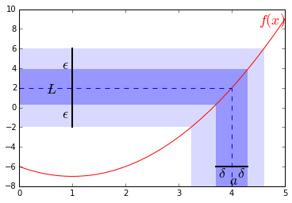

#极限
##**极限(Limits)**  
本节的重点内容其实是用Python画图...：  
```
    x = np.linspace(0,5,100)
    y = x**2-2*x-6
    plt.plot(x,y,'red')
    
    l = plt.axhline(y=2,xmin=0,xmax=0.8,linestyle="--")
    l = plt.axhline(-8,0,1,linewidth = 2, color = 'black')
    l = plt.axhline(-6,(1+sqrt(7))/5,(1+sqrt(11))/5,linewidth = 2, color = 'black')
    l = plt.axvline(x=4,ymin=0,ymax=float(5)/9, linestyle = "--")
    l = plt.axvline(0,0,1,linewidth = 2, color = 'black')
    l = plt.axvline(1,6.0/18,14.0/18,linewidth = 2, color = 'black')
    
    p = plt.axhspan(-2,6,0,(1+sqrt(13))/5,alpha = 0.15, ec = 'none')
    p = plt.axvspan((1+sqrt(5)),(1+sqrt(13)),0,1.0/3,alpha = 0.15, ec = 'none')
    p = plt.axhspan(0,4,0,(1+sqrt(11))/5,alpha = 0.3, ec = 'none')
    p = plt.axvspan((1+sqrt(7)),(1+sqrt(11)),0,4.0/9,alpha = 0.3, ec = 'none')
    
    plt.axis([0,5,-8,10])
    plt.axis('off')
    
    plt.text(0.8,-1,r"$\epsilon$", fontsize = 18)
    plt.text(0.8,4,r"$\epsilon$", fontsize = 18)
    plt.text(3.75,-7.3,r"$\delta$", fontsize = 18)
    plt.text(4.1,-7.3,r"$\delta$", fontsize = 18)
    
    plt.show()
```



函数的极限，描述的是输入值在接近一个特定值时函数的表现。

我们若要称函数$$f(x)$$在$$x=a$$处的极限为$$L$$即：$$\lim_{x\rightarrow a}f(x)=L$$，则对任意一个$$\epsilon > 0$$，我们要都能找到一个$$\delta >0$使得当$$x$$的取值满足$$0<|x-a|<\delta$$时有$$0<|f(x)-L|<\epsilon$$
